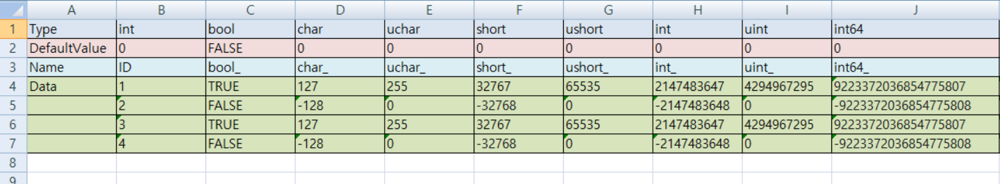

# GameDataConverter

## 1. 기능 정의
- 정의된 형식의 EXCEL 파일들을 분석 후 테이터 사용에 필요한 인터 페이스 코드와 데이터 파일을 분리해서 생성합니다. 
- C++ 에서 다수의 데이터 파일을 로딩해 사용해야 할 경우, 데이터 파일을 로딩하기 위한 개별 코드를 작성해야 합니다. 그리고 데이터 파일의 수가 많아질수록 추가 작업이 많아짐니다. 
- 하지만 GameDataConverter 를 사용하면, 필요 코드를 자동으로 생성함에 따라 데이터 관리가 단순해지며, 데이터들을 하나의 파일로 구성할 수 있어, 데이터 관리의 효율성을 높일 수 있습니다.

>```mermaid
>flowchart LR
>    A[EXECEL_FILES]
>    B[GameDataConverter]
>    C[GameDataTable_generated.h]
>    D[GameDataTable_generated.cpp]
>    E[GameData.json]
>    A-->|분석|B
>    B-->|.h 생성|C
>    B-->|.cpp 생성|D
>    B-->|DataFile 생성|E
>```


## 2. 사용 방법
### A. 설정 파일 생성 (config.json)
```json
{
    "LoadPath": "D:\\Work\\GameDataConverter\\GameDataFiles\\",
    "WritePath": "D:\\Work\\GameDataConverter\\OutGameDataFiles\\"
}
```

### B. EXCEL 파일 생성 규칙
- 설정 파일에 등록된 경로에 데이터 EXCEL 파일들 생성해야 합니다.
- 데이터 파일은 영문과 숫자로 생성되어야하며, 중복 사용이 불가능 합니다.
- Type : 컬럼에 사용할 변수의 타입 정의
- DefaultValue : 컬럼의 기본값 정의
    - 지원 타입 : bool, char, uchar, short, ushort, int, uint, int64, uint64, long, ulong, longlong, ulonglong, string, float, double
- Name : 컬럼의 변수명 정의 ('영문', '숫자', '_' 만 사용 가능)
  - ID 컬럼은 필수 사항이며, 값이 중복 되어서는 않됨니다. (기본 키 값으로 사용)
- Data : 실제 데이터들

#### ※ BaseType.xlsx 의 일부분 예시
 </img>
.


## 3. 샘플 프로젝트 사용법
- 1

## 4. 프로젝트 구성
- GameDataConverter - GDC 기본 프로젝트
    - ConfigJsonParser.h : 설정 데이터 관리
    - ExcelFileLoader.h : EXECEL_FILES 을 읽어들여, DataCoordinator에 데이터 분리
    - DataCoordinator.h : EXECEL_FILES의 데이터 파일들의 정보를 테이블 형태와 데이터로 분리해 테이블 정보 생성 후 관리    
    - CodeGenerator.h : DataCoordinator에 정리된 테이블의 형테 정보를 이용해 코드 생성(.h, .cpp)
    - JsonFileWriter.h : DataCoordinator에 정리된 데이터 부분을 .json 파일로 저장

- GameDataLoadTest - GDC 테스트 프로젝트
    - BaseType.xlsx
    - BaseType_temp.xlsx

- GameDataFiles - 데이터 파일 위치 (EXECEL_FILES)
    - BaseType.xlsx
    - BaseType_temp.xlsx
     
- OutGameDataFiles - 생성된 결과물 위치
    - .h : 자동 생성된 Row 및 Table 정보들을 정의한 .h 파일
    - .cpp : 자동 생성된 Row 및 Table 정보들을 정의한 .cpp 파일
    - .json : 통합된 데이터 파일
  
- Vender - 사용한 외부 라이브러리
    - OpenXLSX : xlsx 파일 로드에 사용
    - rapidjson : json 파일 로드 및 생성에 사용

## 100.개선해야 할 것들
- 멀티 쓰레드를 이용한 성능 향상
- 자동 생성된 코드에서 rapidjson 종속성 제거 
    - 데이터 파일의 포멧을 json이 아닌 자체 포멧으로 변경
- 자체 타입의 enum 사용 방안 강구